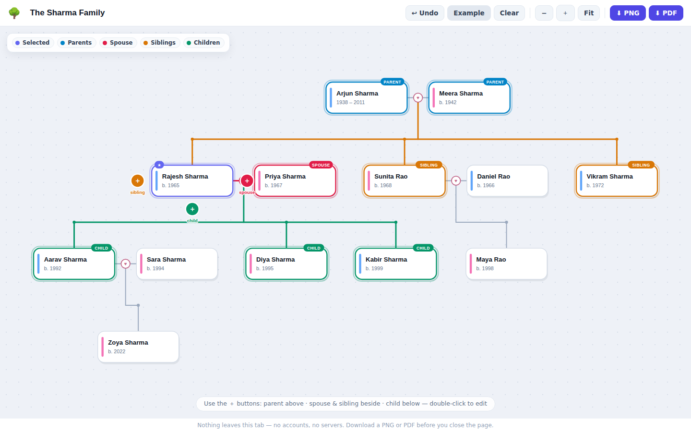

# 🌳 Family Tree Builder

A zero-install, zero-storage website for sketching a family tree and downloading it as a **PNG** or **PDF**. Everything runs in your browser — no accounts, no servers, no data ever leaves the tab.



## Run it

No build step and no dependencies. Either:

- open `index.html` directly in any modern browser, or
- serve the folder (`python3 -m http.server`) and visit `http://localhost:8000`, or
- host it on GitHub Pages (Settings → Pages → deploy from branch).

## How it works

**Adding people is one click.** Select any person and four color-coded ＋ buttons appear around their card, placed where the relative will go:

- 🔵 **＋ parent** above
- 🔴 **＋ spouse** beside
- 🟠 **＋ sibling** beside
- 🟢 **＋ child** below

Type a name (Enter saves), and the tree re-lays itself out automatically — couples joined by a ♥ badge, siblings hanging from a shared rail with a dot per sibling, children dropping from the midpoint of their parents' marriage line.

**Seeing relationships is one click too.** Selecting a person lights up their whole immediate family in distinct colors — parents (blue), spouse (rose), siblings (amber), children (green) — with a labeled badge on every related card and matching colors on the connecting lines, so you can read a busy tree at a glance.

**When it looks right, download it.** The PNG (2× resolution) and PDF exports are generated entirely in the browser — the PDF is assembled byte-by-byte in plain JavaScript, no libraries.

**Save your work as XML, drawio-style.** *💾 XML* downloads the tree as a readable `.xml` file, and *📂 Open* (or dragging the file onto the canvas) restores it exactly so you can keep editing later — the only way anything persists, since the app itself stores nothing. The format is plain enough to edit by hand:

```xml
<?xml version="1.0" encoding="UTF-8"?>
<familyTree app="family-tree-builder" version="1" title="The Sharma Family">
  <person id="p1" name="Arjun Sharma" gender="m" birth="1938" death="2011"/>
  <person id="p2" name="Meera Sharma" gender="f" birth="1942"/>
  <person id="p3" name="Rajesh Sharma" gender="m" birth="1965"/>
  <union id="u1">
    <partner ref="p1"/>
    <partner ref="p2"/>
    <child ref="p3"/>
  </union>
</familyTree>
```

## Features

- Automatic layered layout: generations in rows, parents centered over children, no overlaps
- Multiple spouses, single parents, and sibling groups with unknown parents all supported
- Edit anyone via double-click (name, birth/death years, gender, note); delete with cleanup
- Pan (drag), zoom (scroll or buttons), fit-to-screen
- Undo (Ctrl+Z), Delete key removes the selected person, Esc deselects
- Example family to explore, editable tree title that becomes the export/save filename
- Save/reload as XML (button, empty-state link, or drag & drop); invalid files are rejected with a clear message and never touch the current tree
- Nothing is stored anywhere — the page warns you before closing if a tree exists

## Files

| File | Purpose |
|---|---|
| `index.html` | Page shell, toolbar, modals |
| `style.css` | All styling |
| `app.js` | Data model, auto-layout, SVG rendering, PNG/PDF export |
